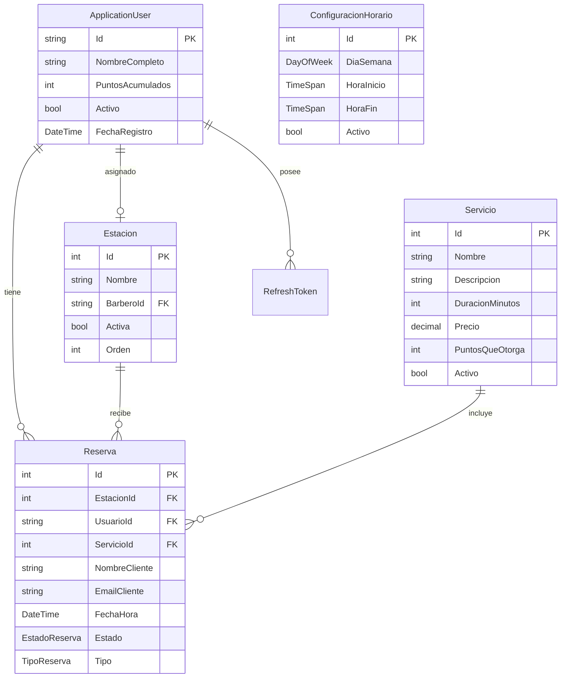

<p align="center">
  
  
  
  
  
</p>

# ✂️ BarberBooking - Sistema de Reservas para Barbería

<p align="center">
  <strong>Sistema completo de gestión de citas para barberías y peluquerías</strong>
</p>

<p align="center">
  <a href="#-características">Características</a> •
  <a href="#-tecnologías">Tecnologías</a> •
  <a href="#-arquitectura">Arquitectura</a> •
  <a href="#-instalación">Instalación</a> •
  <a href="#-uso">Uso</a> •
  <a href="#-api">API</a>
</p>

---

## 📋 Descripción

**BarberBooking** es un sistema integral de gestión de reservas diseñado específicamente para barberías y peluquerías. Permite a los clientes reservar citas de forma rápida y sencilla, mientras proporciona a los administradores herramientas completas para gestionar el negocio.

### 🎯 Objetivos del Proyecto

- Facilitar la reserva de citas para clientes (registrados e invitados)
- Proporcionar un panel administrativo completo para gestión del negocio
- Optimizar la asignación de estaciones y barberos
- Implementar un sistema de fidelización mediante puntos

---

## ✨ Características

### 👤 Para Clientes
- ✅ Reserva de citas online 24/7
- ✅ Vista de disponibilidad en tiempo real
- ✅ Reserva rápida (próximo hueco disponible)
- ✅ Historial de citas
- ✅ Sistema de puntos por fidelización
- ✅ Reservas sin registro (modo invitado)

### 💼 Para Administradores
- ✅ Gestión de estaciones/sillones
- ✅ Gestión de barberos y asignaciones
- ✅ Catálogo de servicios configurable
- ✅ Configuración de horarios de atención
- ✅ Dashboard con métricas del negocio
- ✅ Gestión de usuarios y roles

### 🔐 Seguridad
- ✅ Autenticación JWT con refresh tokens
- ✅ Sistema de roles (Admin, Barbero, Cliente, Invitado)
- ✅ Protección de endpoints por autorización

---

## 🚀 Tecnologías

### Backend
| Tecnología | Versión | Uso |
|------------|---------|-----|
| .NET | 10.0 | Framework principal |
| .NET Aspire | 9.0 | Orquestación de servicios |
| ASP.NET Core | 10.0 | Web API REST |
| Entity Framework Core | 9.0 | ORM (Code First) |
| ASP.NET Core Identity | 9.0 | Autenticación y autorización |
| SQL Server | 2022 | Base de datos |
| JWT Bearer | 10.0 | Tokens de autenticación |
| MediatR | 12.4 | Patrón CQRS |
| FluentValidation | 11.3 | Validaciones |
| AutoMapper | 12.0 | Mapeo de objetos |
| Serilog | 8.0 | Logging estructurado |
| Swagger/OpenAPI | 6.9 | Documentación API |

### Frontend
| Tecnología | Versión | Uso |
|------------|---------|-----|
| Blazor Web | .NET 10 | Interfaz de usuario |

### Testing
| Tecnología | Versión | Uso |
|------------|---------|-----|
| xUnit | 2.9 | Framework de testing |
| Moq | 4.20 | Mocking |
| FluentAssertions | 8.8 | Assertions legibles |

---

## 🏗️ Arquitectura

El proyecto sigue los principios de **Clean Architecture** con una clara separación de responsabilidades:

```
📦 BarberBooking
│
├── 📁 0.Shared/                              # Código compartido
│   └── SalonAppointmentSystem.Shared/
│       ├── DTOs/                             # Data Transfer Objects
│       │   └── Auth/                         # DTOs de autenticación
│       ├── Enums/                            # Enumeraciones compartidas
│       ├── Models/                           # Modelos comunes (ApiResponse)
│       └── Constants/                        # Constantes globales
│
├── 📁 1.Backend/                             # API REST
│   └── SalonAppointmentSystem.ApiService/
│       ├── 1.Domain/                         # Capa de Dominio
│       │   ├── Entities/                     # Entidades de negocio
│       │   ├── Common/                       # Clases base
│       │   └── Interfaces/                   # Contratos de repositorios
│       ├── 2.Application/                    # Capa de Aplicación
│       │   ├── Common/                       # Interfaces, Settings
│       │   ├── Commands/                     # Comandos CQRS
│       │   └── Queries/                      # Consultas CQRS
│       ├── 3.Infrastructure/                 # Capa de Infraestructura
│       │   ├── Persistence/                  # DbContext, Repositorios
│       │   ├── Identity/                     # Configuración Identity
│       │   ├── Services/                     # Servicios externos
│       │   └── Seeders/                      # Datos iniciales
│       └── 4.Presentation/                   # Capa de Presentación
│           └── Controllers/                  # Controladores API
│
├── 📁 2.Frontend/                            # Aplicación Web
│   └── SalonAppointmentSystem.Web/
│
├── 📁 3.Orchestrator/                        # Orquestación
│   ├── SalonAppointmentSystem.AppHost/       # Host de Aspire
│   └── SalonAppointmentSystem.ServiceDefaults/
│
└── 📁 4.Tests/                               # Pruebas
    └── SalonAppointmentSystem.ApiService.Tests/
        ├── Domain.Tests/                     # Tests de dominio
        ├── Infrastructure.Tests/             # Tests de infraestructura
        └── Integration.Tests/                # Tests de integración
```

### 📊 Modelo de Datos



---

## 💻 Instalación

### Prerrequisitos

- [.NET 10 SDK](https://dotnet.microsoft.com/download/dotnet/10.0)
- [SQL Server 2022](https://www.microsoft.com/sql-server) (o LocalDB)
- [Visual Studio 2022](https://visualstudio.microsoft.com/) o [VS Code](https://code.visualstudio.com/)

### Pasos de Instalación

1. **Clonar el repositorio**
```bash
git clone https://github.com/JohanCalaT/salon-appointment-system.git
cd salon-appointment-system
```

2. **Restaurar dependencias**
```bash
dotnet restore
```

3. **Configurar la base de datos**

Actualizar la cadena de conexión en `appsettings.json` si es necesario.

4. **Aplicar migraciones**
```bash
cd 1.Backend/SalonAppointmentSystem.ApiService
dotnet ef database update
```

5. **Ejecutar la aplicación**
```bash
cd 3.Orchestrator/SalonAppointmentSystem.AppHost
dotnet run
```

6. **Acceder al Dashboard de Aspire**

El dashboard estará disponible en: `https://localhost:17178`

---

## 🎮 Uso

### Dashboard de Aspire

Al ejecutar el AppHost, tendrás acceso a:
- **Dashboard de Aspire**: Monitoreo de todos los servicios
- **API**: Endpoints REST documentados con Swagger
- **Frontend**: Aplicación web Blazor

### Credenciales por Defecto

| Usuario | Email | Contraseña | Rol |
|---------|-------|------------|-----|
| Administrador | admin@barberia.com | Admin123! | Admin |

---

## 📡 API

### Endpoints de Autenticación

| Método | Endpoint | Descripción |
|--------|----------|-------------|
| POST | `/api/auth/register` | Registro de nuevo usuario |
| POST | `/api/auth/login` | Iniciar sesión |
| POST | `/api/auth/refresh-token` | Renovar token de acceso |
| POST | `/api/auth/logout` | Cerrar sesión |

### Ejemplo de Respuesta API

```json
{
  "success": true,
  "message": "Operación exitosa",
  "data": { ... },
  "errors": [],
  "timestamp": "2025-12-01T18:00:00Z"
}
```

---

## 🧪 Testing

Ejecutar todas las pruebas:

```bash
dotnet test
```

Ejecutar con cobertura:

```bash
dotnet test --collect:"XPlat Code Coverage"
```

**Estado actual:** ✅ 19 tests pasando

---

## 📈 Roadmap

- [x] Configuración inicial del proyecto
- [x] Modelo de datos con Entity Framework Core
- [x] Sistema de autenticación JWT
- [x] Estructura de Clean Architecture
- [x] Proyecto de tests unitarios
- [ ] CRUD completo de Reservas
- [ ] Panel de administración
- [ ] Interfaz de cliente para reservas
- [ ] Sistema de notificaciones
- [ ] Reportes y estadísticas

---

## 👥 Equipo

| Nombre | Rol | Contacto |
|--------|-----|----------|
| Johan Eduardo Cala Torra | Desarrollador Principal | jct576@inlumine.ual.es |

---

## 🏫 Información Académica

| Campo | Valor |
|-------|-------|
| **Universidad** | Universidad de Almería (UAL) |
| **Asignatura** | Desarrollo Web Móvil |
| **Curso** | 2024-2025 |
| **Fecha de Inicio** | 25 de Noviembre de 2025 |

---

## 📝 Licencia

Este proyecto es desarrollado con fines académicos para la Universidad de Almería.

---

<p align="center">
  Desarrollado con ❤️ para la Universidad de Almería
</p>

